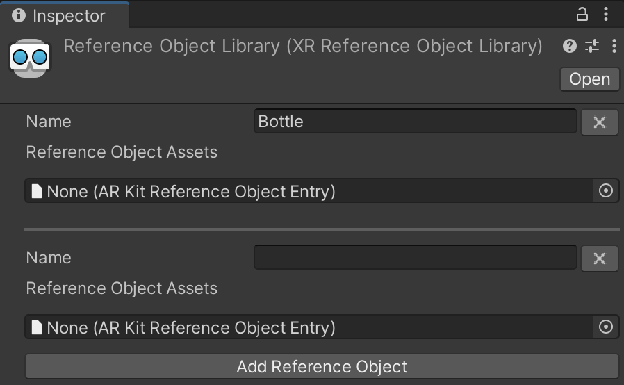

# XR object tracking subsystem

The [XRObjectTrackingSubsystem](xref:UnityEngine.XR.ARSubsystems.XRObjectTrackingSubsystem) is a [tracking subsystem](xref:arsubsystems-manual#tracking-subsystems) that detects three-dimensional objects in the environment which you have previously scanned and stored in a reference object library. Its trackable type is [XRTrackedObject](xref:UnityEngine.XR.ARSubsystems.XRTrackedObject).

> [!NOTE]
> Currently, the [Apple ARKit XR Plug-in](xref:arkit-object-tracking) is the only Unity-supported provider plug-in that implements object tracking. If you are using a 3rd party provider plug-in, refer to your provider's documentation for specific implementation and configuration requirements.

## Terminology

|**Term**|**Description**|
|--------|---------------|
|**Reference object**|A reference object is an object that you have previously scanned and stored in a reference object library. The object tracking subsystem detects and tracks instances of the object in the environment.|
|**Reference object library**|A reference object library is an asset containing a collection of reference objects.|
|**Provider**|The object tracking subsystem, like all AR Foundation subsystems, is an interface. Subsystem implementations are called *providers* and are typically made available in separate packages called *provider plug-ins*. See [Subsystems](xref:arsubsystems-manual) for more information.|

## Creating a reference object library

In a typical object tracking workflow, you create a reference object library in the Editor and then populate the library with reference objects. You must add a provider-specific entry for each provider plug-in your project that supports object tracking. 

To create a reference object library, right click in the Project window and select **Assets** &gt; **Create** &gt; **XR** &gt; **Reference Object Library**.

This creates a new `ReferenceObjectLibrary` asset in your project. To add a reference object to the library, select this asset, then click **Add Reference Object**:

<br/>*A reference object library*

Each reference object has a **Name**, followed by a list of provider-specific entries, which are required in order for object detection to work on device. In the example above, each object has one entry for the ARKit provider. 

The asset format for a reference object entry depends on the provider implementation. The [Apple ARKit XR Plug-in](xref:arkit-object-tracking) uses the `.arobject` format defined by Apple. See the [Scanning and Detecting 3D Objects](https://developer.apple.com/documentation/arkit/scanning_and_detecting_3d_objects) page on Apple's developer website for more information.

## Using a reference object library at runtime

The simplest way to use a reference object library is to save its reference to the tracked object manager's **Reference Library** field via the Inspector. However, you can also create and use a new reference object library at runtime as shown below:

```csharp
XRReferenceObjectLibrary myLibrary = ScriptableObject.CreateInstance(typeof(XRReferenceObjectLibrary));
GetComponent<ARTrackedObjectManager>().referenceLibrary = myLibrary;
```

If your project uses the object tracking subsystem without an [ARTrackedObjectManager](xref:UnityEngine.XR.ARFoundation.ARTrackedObjectManager), you can also set the reference object library directly via the subsystem's `library` property. In this case, make sure to assign the reference library to the subsystem's `library` property before you start the subsystem.

### Adding a reference object at runtime

To add a new reference object to a reference object library at runtime, follow the steps shown in the example below:

```csharp
// Create an XRReferenceObject
var referenceObject = new XRReferenceObject("My reference object");

// Add provider-specific entry data to the reference object
referenceObject.AddEntry(arobject);

// Add the reference object to the manager's reference object library
GetComponent<ARTrackedObjectManager>().referenceLibrary.Add(referenceObject);
```
